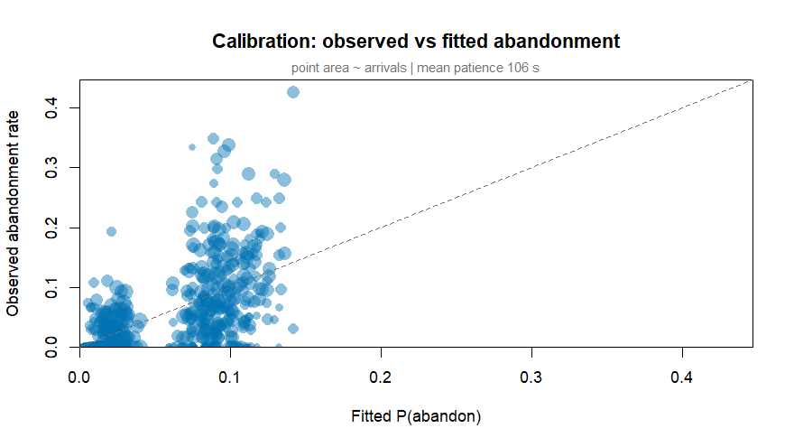
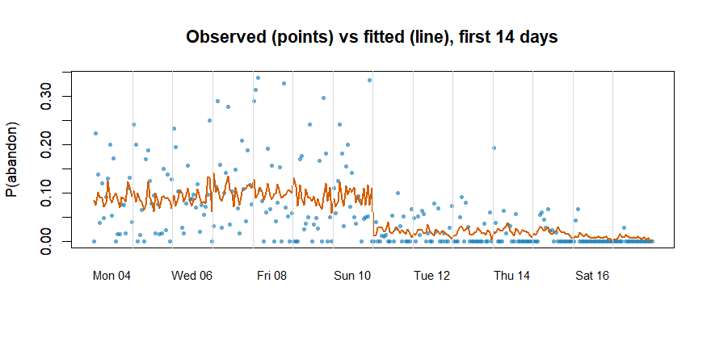
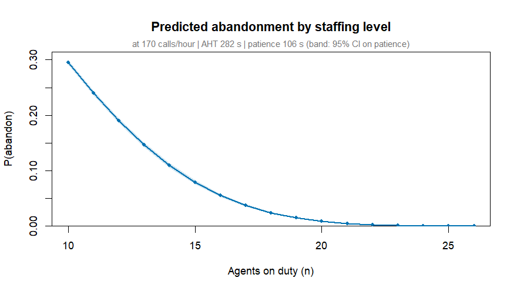
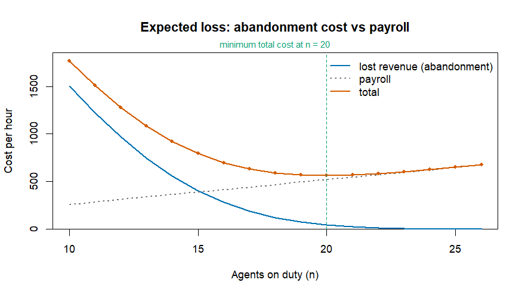

# erlangR

Erlang-A queueing models for staffing decisions, written for the generic
statistical workflow: **fit, predict, plot** -- like `glm()`, not like a
calculator.

The model is M/M/n+M ("Erlang A"): Poisson arrivals at rate `lambda`,
exponential service at rate `mu` per agent, and exponentially distributed
caller *patience* with mean `1/theta` -- a caller still waiting when their
patience runs out abandons. That is the whole model: **three parameters**,
estimated from data, plus one decision variable `n_agents`. The headline
quantity is `P(abandon | n_agents)`, which prices staffing decisions in lost
calls rather than in service-level conventions. Occupancy caps, shrinkage,
and SLA targets are deliberately *not* model inputs -- occupancy is an
output, shrinkage is a scheduling translation (see `schedule_headcount()`),
and SLAs are replaced by `expected_loss()`.

Why this package exists: CRAN has no analytic Erlang-A implementation.
[`queueing`](https://cran.r-project.org/package=queueing) covers classical
M/M/c (no abandonment), simulation frameworks like `simmer` can renege but
give no likelihood, and the small
[`ErlangC`](https://cran.r-project.org/package=ErlangC) package has no
patience model. None of them estimate parameters from data.

## Capabilities

* **Exact analytic measures** for Erlang A from the stationary birth--death
  distribution, in log space (stable into thousands of agents):
  `p_abandon()`, `p_wait()`, `mean_wait()`, `occupancy()`, plus classical
  `erlang_b()` / `erlang_c()` as limiting cases. Defined for any load --
  abandonment stabilises overloaded systems.
* **Maximum-likelihood fitting** from ordinary interval data
  (`erlang_fit()`): exponential MLE for service, profile binomial MLE for
  patience, and a Poisson-GLM **arrival-rate model** (`rate = ~ dow + tod`)
  rather than noisy per-interval plug-ins.
* **Decision tools**: `predict()` gives the abandonment-vs-agents curve with
  patience uncertainty propagated; `expected_loss()` converts it to money
  and finds the cost-minimising staffing level.
* **An exact event-based simulator** (`simulate_erlang_a()`) used to
  validate the analytics in the test suite, generate the example data, and
  power-analyse staffing experiments.
* **Internal test suite** built on closed-form special cases (`theta = mu`
  collapses to a Poisson law), conservation identities of the chain,
  simulator agreement, and parameter recovery -- no external oracles.

## The model in one chunk


``` r
library(erlangR)

# 120 calls/hour, 280 s mean handle, 100 s mean patience (rates per second)
erlang_a(n_agents = 12, lambda = 120 / 3600, mu = 1 / 280, theta = 1 / 100)
#> Erlang-A (M/M/n+M) queue
#>   agents 12 | lambda 0.0333333 | mu 0.00357143 (mean handle 280) | theta 0.01 (mean patience 100)
#>   offered load   : 9.333 erlangs
#>   P(abandon)     : 0.05563
#>   P(wait > 0)    : 0.1882
#>   mean wait      : 5.563 (same time unit as the rates)
#>   occupancy      : 0.7345

p_abandon(n_agents = 9:15, lambda = 120 / 3600, mu = 1 / 280, theta = 1 / 100)
#> [1] 0.17955929 0.12735028 0.08627226 0.05563469 0.03407010 0.01978727 0.01089631
```

## Fitting from half-hour data

`callcenter` ships with the package: four weeks of half-hour intervals,
simulated from a known ground truth (mean handle 280 s, mean patience 100 s)
with staffing alternating week by week between a lean and a rich rule -- the
"vary the agents every other week" experiment that real centres can run.


``` r
head(callcenter)
#>                    ts       date   tod dow week  arm agents arrivals abandoned
#> 1 2026-05-04 08:00:00 2026-05-04 08:00 Mon    1 lean      8       27         0
#> 2 2026-05-04 08:30:00 2026-05-04 08:30 Mon    1 lean     10       49        11
#> 3 2026-05-04 09:00:00 2026-05-04 09:00 Mon    1 lean     12       65         9
#> 4 2026-05-04 09:30:00 2026-05-04 09:30 Mon    1 lean     14       77         3
#> 5 2026-05-04 10:00:00 2026-05-04 10:00 Mon    1 lean     15      100        12
#> 6 2026-05-04 10:30:00 2026-05-04 10:30 Mon    1 lean     15       83         4
#>   handled   aht
#> 1      27 280.6
#> 2      38 273.7
#> 3      56 290.7
#> 4      74 288.6
#> 5      88 325.8
#> 6      79 307.2
```

Fit the model. The arrival rate is *modelled* (Poisson GLM, multiplicative
day-of-week and time-of-day effects) instead of plugging each interval's own
noisy count back in:


``` r
fit <- erlang_fit(callcenter, rate = ~ dow + tod)
fit
#> Erlang-A model fit (M/M/n+M), interval maximum likelihood
#>   intervals      : 560 informative (period 1800 s)
#>   arrival rate   : 93.4 calls/hour on average [Poisson GLM: ~dow + tod]
#>   mean handle    : 282.0 s   (mu = 0.00355 /s, exponential MLE)
#>   mean patience  : 106.3 s   (95% CI 89.7-126.0)   <- the fitted parameter
#>   log-likelihood : -1139.9 (binomial, df = 1)
```

The generating patience (100 s) is recovered inside the interval. The same
data fitted with the saturated per-interval rate (`rate = "interval"`)
returns a patience of ~165 s: noisy rate plug-ins meet a convex
`p_abandon(lambda)` and bias the estimate -- the reason the rate model is a
formula. See `?erlang_fit` for the mechanics.


``` r
plot(fit, type = "calibration")
```




``` r
plot(fit, type = "series", days = 14)
```



The series view shows the experiment doing its work: lean weeks run visibly
hotter than rich weeks, and the fitted curve tracks both.

## The decision curve


``` r
pred <- predict(fit, n_agents = 10:26, arrivals_per_hour = 170)  # busy-hour load
plot(pred)
```



## From abandonment to money

A service level target says "answer 80% in 20 seconds" and leaves the cost
of doing so implicit. Pricing abandonment makes the trade explicit: lost
revenue falls as staffing rises, payroll climbs, and somewhere the marginal
agent stops paying for themselves.


``` r
loss <- expected_loss(pred, value_per_call = 30, cost_per_agent_hour = 26)
loss
#> Expected hourly loss at 170 calls/hour (value/call 30.00, agent cost/hour 26.00)
#>   cost-minimising staffing: n = 20 agents
#> 
#>  n_agents p_abandon lost_per_hour staff_per_hour total_per_hour
#>        17     3.71%           189            442            631
#>        18     2.40%           122            468            590
#>        19     1.49%            76            494            570
#>        20     0.89%            45            520            565
#>        21     0.51%            26            546            572
#>        22     0.28%            14            572            586
#>        23     0.15%             8            598            606
```


``` r
plot(loss)
```



The model's recommendation is a prediction, not a verdict -- the honest next
step is exactly the experiment embedded in `callcenter`: alternate staffing
levels on a schedule and compare realised abandonment with the predicted
curve.

## Scheduling helpers

The model's `n_agents` is bodies answering, not bodies rostered. Those
translations live outside the model on purpose:


``` r
agents_for_abandon(0.02, lambda = 170 / 3600, mu = 1 / 280, theta = 1 / 100)
#> [1] 19
schedule_headcount(16, shrinkage = 0.3)
#> [1] 23
```

## Assumptions and roadmap

Honest caveats: intervals are treated as independent steady-state systems
(the standard SIPP approximation); patience is exponential; the patience SE
treats arrival and service rates as plug-ins. On the roadmap, roughly in
order: smooth/hierarchical arrival-rate models (`lambda(t)` via splines or
GPs), non-exponential patience, transient (within-interval) dynamics,
waiting-time distribution measures, and a vignette on designing and
analysing staffing experiments.

## Installation

```r
# install.packages("remotes")
remotes::install_github("chjacamp/erlangR")
```

## Development notes

`dev/site-verification/` contains a separate, pre-package exercise:
reverse-engineering and matching a popular online Erlang calculator
cell-for-cell. It is kept for provenance and is not part of the package or
its tests.
